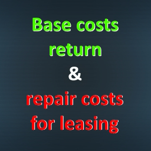

 

<h3 align="center"><u>FS22_BaseCostsReturnAndRepairCostsForLeasing</u></h3>

    Schluss damit die Schlepper und Geräte des Händlers kaputt zu fahren und dafür nicht belangt zu werden. 
    Mit dieser Mod müsst ihr die Reperaturkosten bei der Rückgabe des Schleppers oder Gerätes bezahlen. 
     
    Dafür bekommst du die Basiskosten (Kaution) die Anfangs bezahlt wurde, wieder zurück.

# Copyright
Copyright (c) 2023 [Dennis Schmitt](https://github.com/peppie84).
All rights reserved.

(<a href="#readme-top">back to top</a>)
